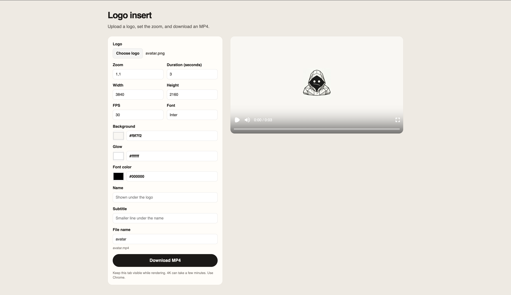

# Try Remotion



[](LICENSE)
[](https://lostcausepublication.github.io/try-remotion/)

Upload an SVG or PNG, preview a zoom-in logo insert, and download an MP4. Rendering runs in the browser with [Remotion](https://www.remotion.dev/).

**[Open the live demo](https://lostcausepublication.github.io/try-remotion/)**

## Features

- Upload an SVG or PNG logo
- Preview the animation with Remotion Player
- Download an H.264 MP4 rendered in the browser
- Optional name and subtitle under the logo, using any [Google Font](https://fonts.google.com/) name
- Controls for zoom, duration, resolution, FPS, colors, and glow

## Requirements

- [Node.js](https://nodejs.org/) 22 or later
- **Chrome** for MP4 export (4K renders can take a few minutes)
- Keep the tab visible while a render is in progress

## Quick start

```bash
npm i
npm run dev
```

Open the URL Vite prints.

| Script | What it does |
| --- | --- |
| `npm run dev` | Start the web app (Vite) |
| `npm run studio` | Open Remotion Studio with the sample logo |
| `npm run lint` | Run ESLint and TypeScript |
| `npm run build` | Production build of the web app |

## Usage

Defaults are 3840×2160, 30 fps, 3 seconds, and a zoom of 1.10. The downloaded file uses the logo’s name (`avatar.png` becomes `avatar.mp4`) unless you change **File name**.

Name and subtitle are optional lines under the logo. Font is any Google Font name, such as `Inter`.

## Tech stack

- [Vite](https://vite.dev/) and React 19
- [Remotion Player](https://www.remotion.dev/docs/player) for preview
- [Remotion Web Renderer](https://www.remotion.dev/docs/web-renderer) for in-browser MP4 export

## Contributing

See [CONTRIBUTING.md](CONTRIBUTING.md). This project follows the [Code of Conduct](CODE_OF_CONDUCT.md).

## License

This repository is licensed under the [MIT License](LICENSE).

Remotion has its own license terms for some companies. [Read them here](https://github.com/remotion-dev/remotion/blob/main/LICENSE.md).
